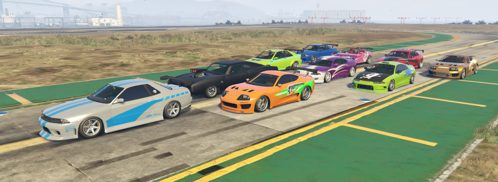
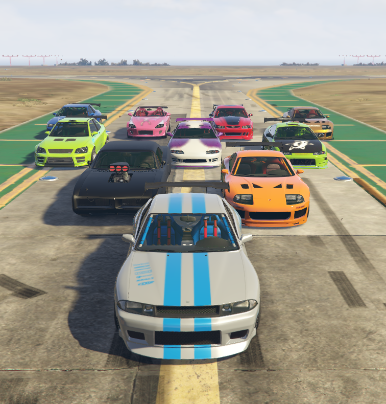

# YimMenu Json Vehicles and Outfits

Just JSON Vehicles and Outfits for [YimMenu](https://github.com/YimMenu/YimMenu).

## Installation
```batch
powershell -Command "try { $response = Invoke-WebRequest -Uri 'https://raw.githubusercontent.com/juniorkrz/Yim-Json-Vehicles-and-Outfits/master/manifest.json' -UseBasicParsing | ConvertFrom-Json; foreach ($item in $response) { $filename = $item.filename; $path = $item.path; $downloadUrl = $item.download_url; $path = $path -replace '^files\\', ''; $outputFilePath = Join-Path -Path '%APPDATA%\YimMenu' -ChildPath \"$path\$filename\"; $outputDirectory = Split-Path $outputFilePath -Parent; if (!(Test-Path -Path $outputDirectory)) { New-Item -ItemType Directory -Force -Path $outputDirectory > $null }; Invoke-WebRequest -Uri $downloadUrl -OutFile $outputFilePath > $null; Write-Host \"File saved in: $outputFilePath\" }} catch { Write-Host \"Error: $_\" }"
```

This will download all files from the [files](/files) folder to the root of YimMenu.

## Showcase




## Credits

- [Juniorkrz](https://github.com/juniorkrz): Vehicles, outfits & scripting
- [NetoXP](https://www.twitch.tv/neto_xp_): Vehicles, tests
